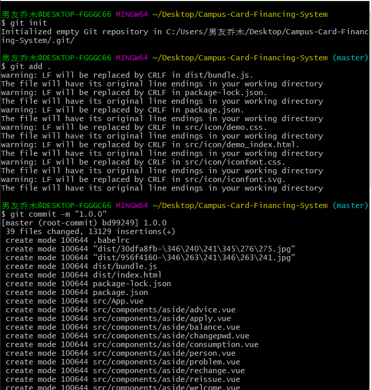
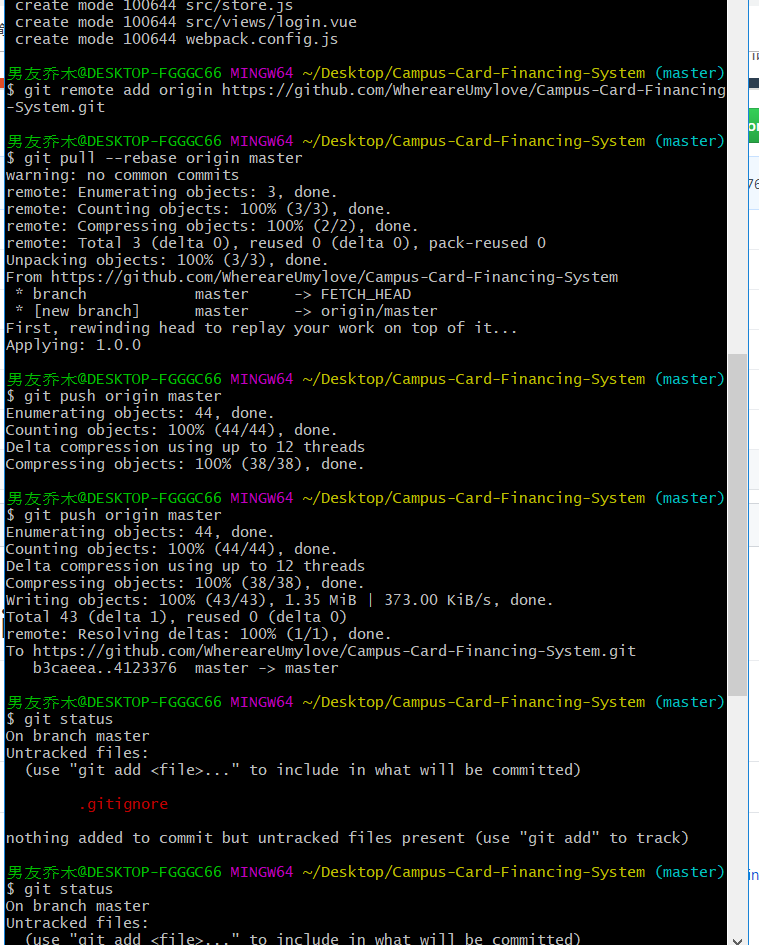

# How-to-use-GIT

GIT的使用方法

<b>首先我们安装GIT</b>    https://git-scm.com/
<b>配置公钥</b>

首先，需要创建我们自己的电脑和github上远程仓库的一个连接，本地Git仓库和Github仓库之间的传输是通过SSH加密的，所以连接时需要配置一下加密的公钥和密钥。

  
先看一下你C盘用户目录下有没有.ssh目录，有的话看下里面有没有id_rsa和id_rsa.pub这两个文件，没有就通过下面命令创建：
  直接在桌面右击-git bash，输入命令行语句   <b>ssh-keygen -t rsa -C "注册github的邮箱地址"</b>
  然后在C:\Users\student（你的用户名）下会找到一个.ssh文件夹，点击进入，会有id_rsa和id_rsa.pub这两个文件，右击记事本打开id_rsa.pub，复制里面的全部内容，登录Github，找到右上角的图标，打开点进里面的Settings，再选中里面的SSH and GPG KEYS，点击右上角的New SSH key，然后Title里面随便填，再把刚才id_rsa.pub里面的内容复制到Title下面的Key内容框里面，最后点击Add SSH key。

  
至此，你的计算机和github账户就建立了一个连接，换电脑需要重新添加公钥。（当然首先你得有一个github账户，直接访问github的官网然后sign up即可，就不给链接了直接baidu搜索github官网就可以了）

<b>git上传项目到github账户</b>

进入你需要上传的项目的根目录（必须是要上传的项目的根目录下），右击-git bash，以下是一系列的命令行语句：

git config --global user.name "你的github用户名"

git config --global user.email "你的github账户邮箱"git init 

（会生成一个.git隐藏文件夹，如果没有，baidu具体操作，给一个win10的链接：https://jingyan.baidu.com/article/acf728fd2853fef8e410a37f.html）

git add .（添加你需要上传的文件，后面跟指定文件名，. 代表该文件夹下全部文件）

git commit -m "提交时的注释信息"（这个操作是将文件提交到本地仓库）

你的github页面右上角有一个加号，点击加号，new repository新建一个公开的仓库，（私有的要钱）：

<b>新建仓库</b>

一般同时要生成一个README.md文件，也就是描述你的项目用的。

git remote add origin 仓库地址

仓库地址就是右边展开的那个，.git结尾的。<b>git pull --rebase origin master</b> （这个操作是把你github项目上的文件拉到本地，如果github上的文件本地没有，本地文件是无法push上去的，现在你的仓库里有一个README文件，所以要先下拉到本地才能执行上传操作，执行完以后你本地应该是有一个README.md的）git push origin master至此全部结束。

github删除文件这里呢有一个坑，很多人可能都和我一开始一样，直接在项目里删除不需要的或者误上传的文件，然后执行git add， git commit，git push一系列的操作，但是结果会是上传失败，为什么呢？原因和之前我们需要进行pull操作是一个，因为github仓库上的文件你本地没有，他就会让你进行pull操作，但是删掉的文件就又会被pull下来，白删了，删文件也是需要用命令行语句删的：git rm "需要删除的文件名"git push origin master

github更新文件比如你修改了一些文件，<b>git status</b> （查看文件状态，这时下面会出现红色的提示  modified 你修改了的文件）git add "你修改了的文件名"（这时你再git status就会发现之前红色的字变成了绿色）<b>
继续操作以更新仓库

git commit  -m "注释信息"

git push origin master
</b>

<b>git 从远程仓库拉取代码</b>

git clone + 远程项目地址（HTTP地址或SSH地址）

例如：git clone git@git.test.net/self_desigin.git

‘git@git.test.net/self_desigin.git’为SSH地址；

注：如果想拉去远程库的项目代码，是不需要事先创建好文件名，比如你本地的站点为WWW,你只需到该目录下，执行
<b>git clone git@git.test.net/self_desigin.git</b>

 

<b>修改本地连接的远程仓库地址</b>

git remote origin set-url [url]

 

<b>一下是删除远程仓库连接和增加新的连接</b>

git remote rm origin

git remote add origin [url]

<b>查看版本差异</b>

git dif

